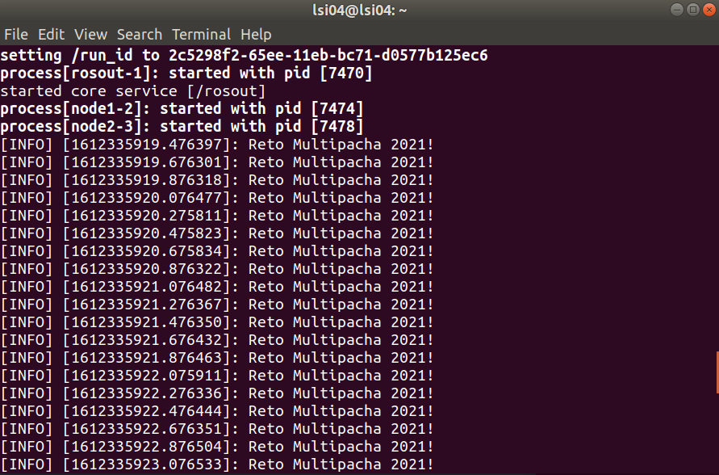
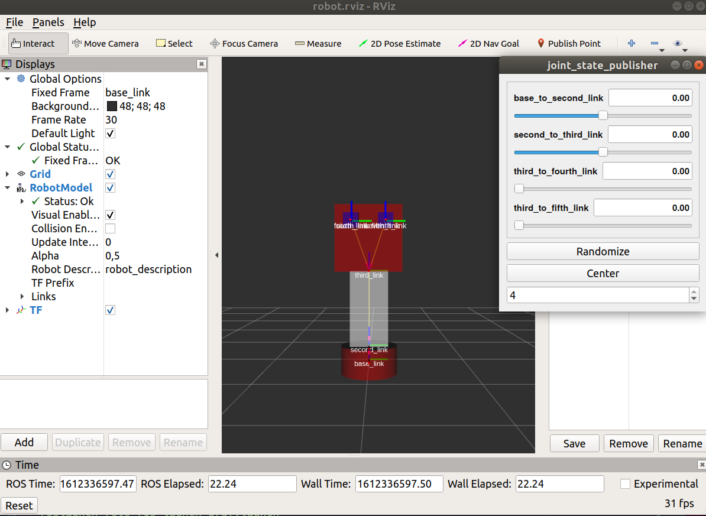
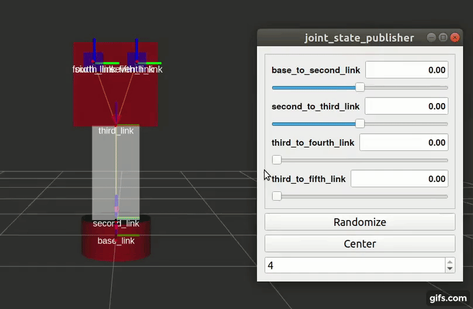
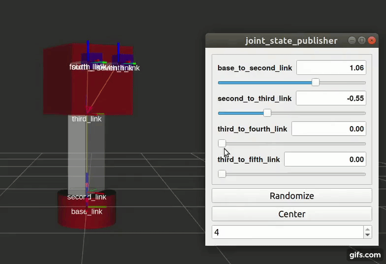
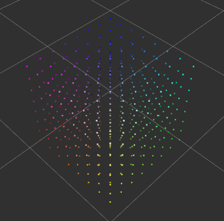
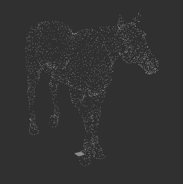

# **PAQUETE RETO_ROS**


# **Documentación**


Este paquete fue creado para participar en el Reto Playtec 2021 y abarca los siguientes temas principalmente:

\-Comunicación por tópicos con mensajes de tipo *String*

\-Visualización del modelo URDF en RViz

\-Visualización de un tópico de tipo *PointCloud2* en RViz

## **Prerequisitos**

* Ubuntu 18.04
* ROS Melodic
* Python 2.7

## **Uso del paquete**

**1) Comunicación por tópicos con mensajes de tipo *String***

Para poder establecer la comunicación y publicar el mensaje "reto playtec 2021", utilizamos los siguientes comandos:

```
source ~/reto_playtec_ws/devel/setup.bash
roslaunch reto_ros launch_string.launch
```
También podemos modificar los nombres de los nodos y el contenido del mensaje a través de argumentos en la linea de comando:

`roslaunch reto_ros launch_string.launch publisher_node_name:=node1 subscriber_node_name:=node2 topic_content:="Reto Multipacha 2021!"`

<br><br>


**2) Visualización del modelo URDF en RViz**

Usaremos los siguientes comandos para poder visualizar en RViz, el modelo URDF ubicado en la carpeta urdf, dentro del paquete:

`roslaunch reto_ros launch_urdf.launch`

<br>

Podemos mover las juntas usamos la interfaz GUI mostrada



<br><br>

**3) Visualización de un tópico de tipo *PointCloud2* en RViz**

Para visualizar el mensaje del archivo `example.pcd` ubicado en la carpeta `pcd_files` en RViz usamos el siguiente comando:

`roslaunch reto_ros launch_pc2.launch`

<br>

También se puede visualizar la nube de puntos de los otros tres archivos `.pcd` ubicados en la carpeta `pcd_files`. Para hacer esto se tiene que pasar el nombre del archivo (sin `.pcd`) como argumento en la linea de comando.

`roslaunch reto_ros launch_pc2.launch filename:=horse`

<br>

Los otros dos archivos .pcd tienen a *cat* y *wolf* como *filename*. Todos estos archivos `.pcd` tienen su respectivo archivo `.rviz`, en el que se guarda la configuración de los parámetros de visualización en RViz.

Los *Displays* permiten visualizar mensajes en Rviz y son definidos por sus propios parámetros de visualización. Cada *Display* cuenta con parámetros de visualización acordes al tipo de mensaje que visualizan. A continuación una lista de los principales parámetros de visualización que hemos usado:

* Fixed Frame: Es el marco de referencia desde donde se visualizan todos los mensajes. En este caso hemos hecho coincidir el nombre del Fixed Frame con el `frame_id` de nuestro `PointCloud2`.

* Topic: Es el tópico el cual contiene el mensaje que se quiere visualizar en su respectivo *Display*. En este caso tuvimos que seleccionar como tópico a `/playtec_pointcloud2​`.

* Style: Para el caso del *display* PointCloud2 indica el estilo con el que se representan los puntos de la nube.

* Size: Indica el tamaño de la visualización de un mensaje en metros.

* Alpha: Indica la transparencia de la visualización de un mensaje. Este parámetro lo utilizamos para seleccionar el nivel de transparencia de los links del robot creado.
