# **Documentación del avance y/o problemas**

## **AVANCE - RETO PARTE 1**

### 1) Creación del espacio de trabajo (workspace) de ROS: reto_playtec_ws/src<br><br>

Lo primero es crear la carpeta del espacio de trabajo `reto_playtec_ws` que incluya otra carpeta llamada `src`, usando el siguiente comando:

`$ mkdir -p -v ~/reto_playtec_ws/src`

Una vez creadas estas carpetas, iremos a una ubicación dentro de la carpeta `reto_playtec_ws` y usaremos el comando `catkin build` para construir el espacio de trabajo de ROS.

```
cd ~/reto_playtec_ws
catkin build
```

Lo que hizo el comando `catkin build` fue convertir la carpeta `reto_playtec_ws` en un espacio de trabajo de ROS a través de la generación de distintos archivos y carpetas. Así luce un espacio de trabajo de ROS:

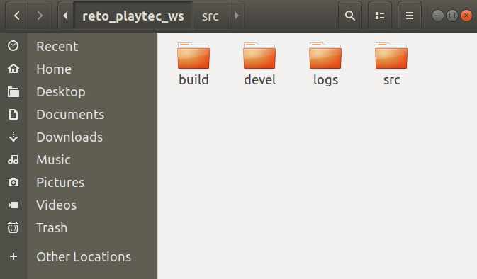<br>

### 2) Creación del paquete reto_ros dentro del workspace reto_playtec_ws/src<br><br>

Primero iremos a la ubicación `src` dentro del workspace `reto_playtec_ws`, luego vamos a usar el comando `catkin_create_pkg` para crear el paquete `reto_ros`. Este paquete tendrá a `roscpp`, `rospy`, `std_msgs` y `sensor_msgs` como dependencias.

```
cd ~/reto_playtec_ws/src
catkin_create_pkg reto_ros roscpp rospy std_msgs sensor_msgs
```

Una vez creado el paquete `reto_ros`, iremos a la ubicación dentro de este paquete. Acá, vamos a crear los directorios  `/launch`, `/urdf` y `/src`.

```
cd ~/reto_playtec_ws/src/reto_ros
mkdir -v launch urdf src
```
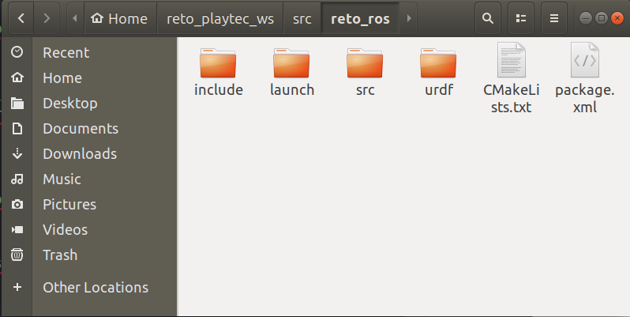<br>

Finalmente lo último que tenemos que hacer es construir el workspace usando el comando `catkin build` desde cualquier ubicación dentro del workspace.

```
cd ~/reto_playtec_ws
catkin build
```

### 3) Creación de los Nodos

Vamos a comenzar creando el archivo `string_publisher.py`, donde implementaremos un publisher. El contenido de este archivo se encuentra [aquí](https://github.com/DMarcelAM/Reto-ROS/tree/main/reto_ros/src/string_publisher.py).

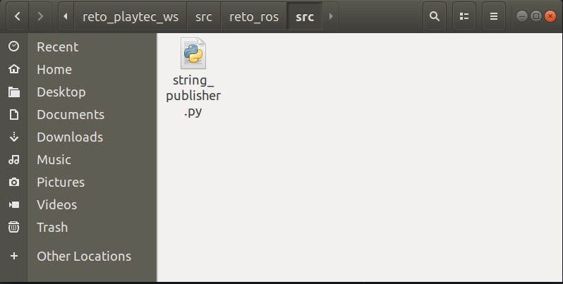<br>

Ahora crearemos el archivo `string_subscriber.py`, donde implementaremos un subscriber. El contenido de este archivo se encuentra [aquí](https://github.com/DMarcelAM/Reto-ROS/tree/main/reto_ros/src/string_subscriber.py).

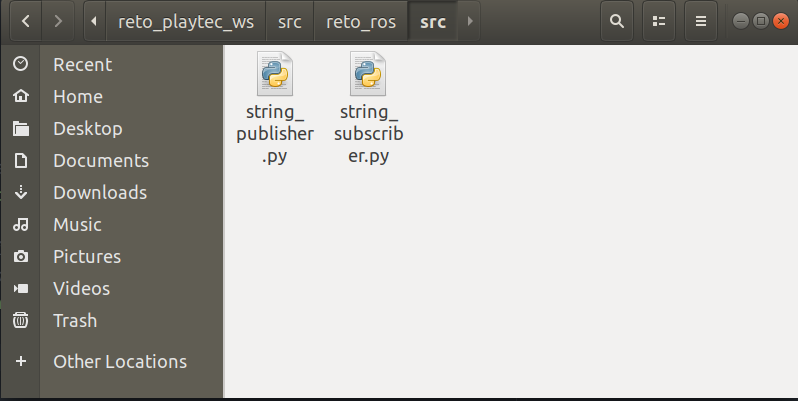<br>

Una vez creado ambos archivos, tenemos que hacer que los archivos sean ejecutables, para esto iremos a la ubicación de estos archivos y usaremos el comando `chmod +x`.

```
cd ~/reto_playtec_ws/src/reto_ros/src
chmod +x string_publisher.py
chmod +x string_subscriber.py
```
### 4) Creación del modelo URDF

Crearemos un archivo XML y lo ubicamos en el directorio URDF, este será el modelo en el formato urdf. Puede ver el contenido del robot [aquí](https://github.com/DMarcelAM/Reto-ROS/blob/main/reto_ros/urdf/robot.urdf).

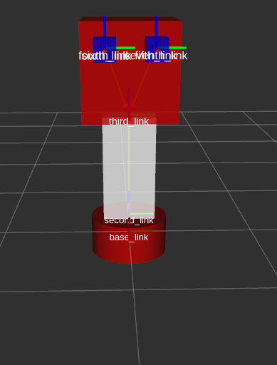<br>

### 5) Creación de los archivos launch

Primero vamos a crear el archivo `.launch` que ejecute los nodos `string_publisher.py` y `string_subscriber.py`. Puede ver el contenido del archivo [aquí](https://github.com/DMarcelAM/Reto-ROS/blob/main/reto_ros/launch/launch_string.launch).

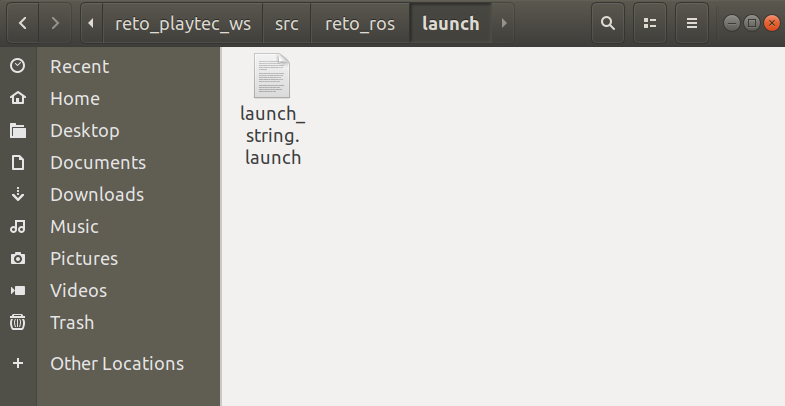<br>

Ahora vamos a ejecutar este archivo usando el comando `roslaunch`. Para hacer esto tenemos que configurar el workspace environment antes.

```
source ~/reto_playtec_ws/devel/setup.bash
roslaunch reto_ros launch1.launch
```
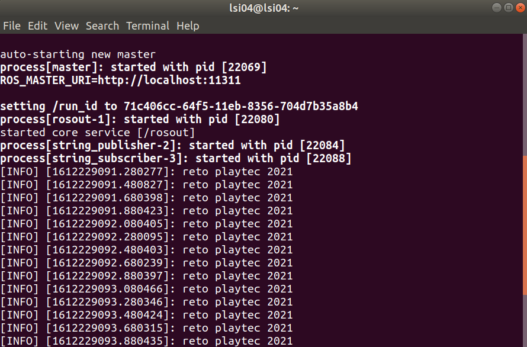<br>

Es hora de crear el archivo `.launch` que lanza el modelo urdf creado. Podremos visualizar el modelo en RViz. El contenido de este archivo se encuentra [aquí](https://github.com/DMarcelAM/Reto-ROS/blob/main/reto_ros/launch/launch_urdf.launch).

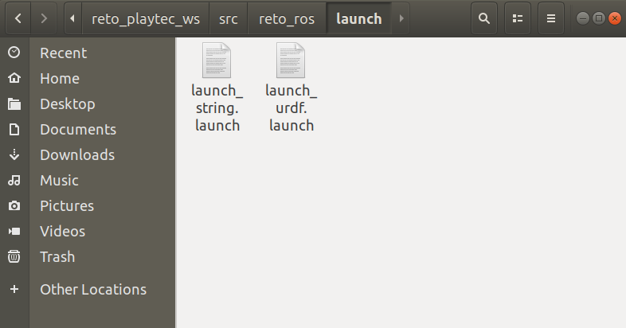<br>

Igual que antes, ejecutaremos este archivo usando el comando `roslaunch`. Para hacer esto tenemos que configurar el workspace environment antes.

```
source ~/reto_playtec_ws/devel/setup.bash
roslaunch reto_ros launch2.launch
```
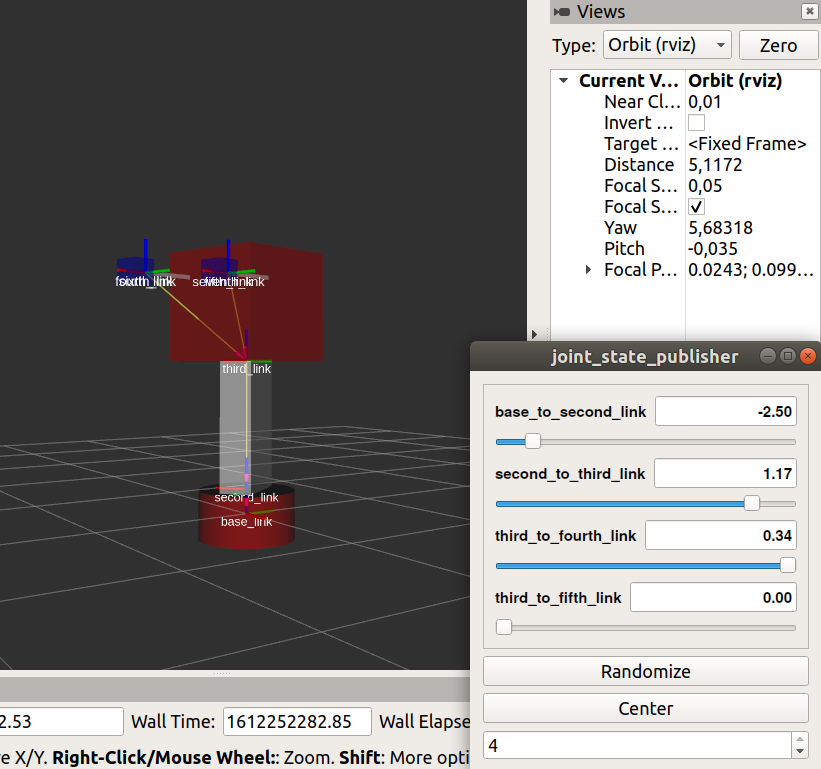<br><br>


## **AVANCE - RETO PARTE 2**

### 1) Creación de los Nodos

Vamos a comenzar creando el archivo `pointcloud2_publisher.py`, donde implementaremos un publisher que publicara un mensaje de tipo PointCloud2. El contenido de este archivo se encuentra [aquí](https://github.com/DMarcelAM/Reto-ROS/blob/main/reto_ros/src/pointcloud2_publisher.py).

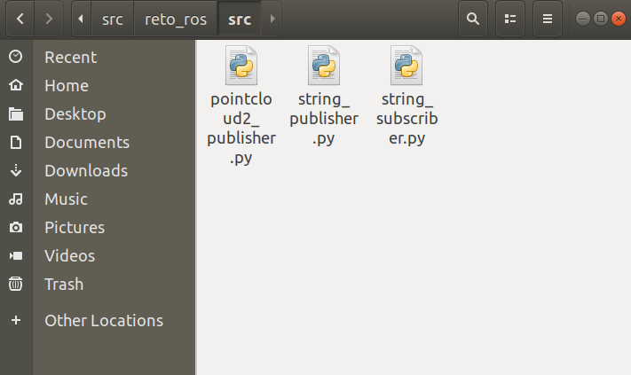<br>

### 2) Visualización de tópicos

Para poder correr nuestro archivo `pointcloud2_publisher.py` y visualizar el tópico `/playtec_pointcloud2` dentro de RViz, crearemos un archivo launch.

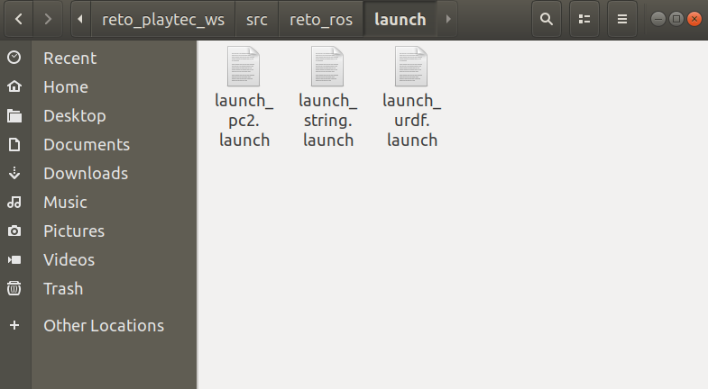<br>

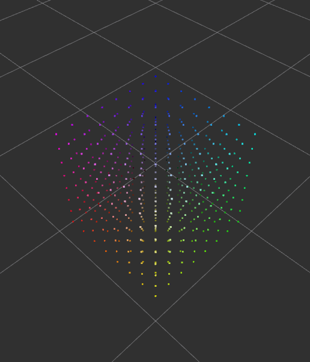<br><br><br>


## **PROBLEMAS**

El mayor problema que tuve en este reto fue en la `Parte 2`, específicamente en la creación del nodo que publica un mensaje del tipo `PointCloud2`. Esto se debe a que hasta ahora, tenía poco conocimiento de este tipo de data y no había trabajado con ella antes. La parte más complicada para mí fue la lectura del archivo `.pcd` para poder publicar el mensaje de tipo `PointCloud2`. Ya que cuando investigaba, la mayor parte de los resultados utilizaba el paquete `pcl_ros` para poder leer archivos `.pcd` de diferentes tipos de `DATA` (`ascii`, `binary` y `binary_compressed`).


